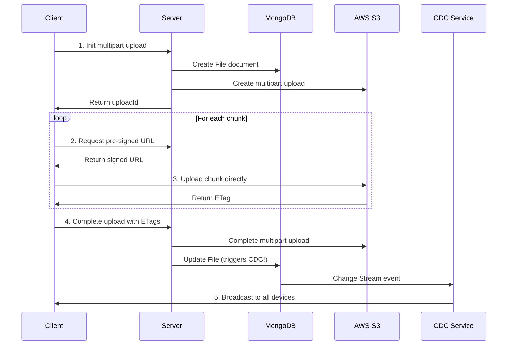
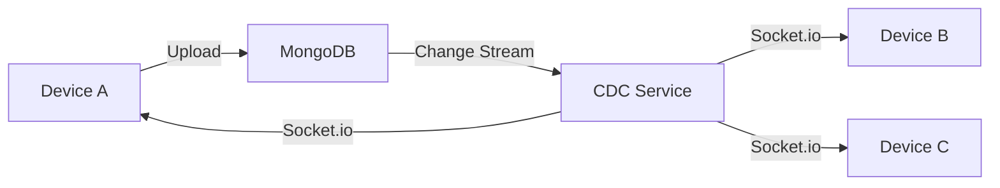

# File Sync App

A full-stack file synchronization application with AWS S3 storage and MongoDB Change Data Capture (CDC) for real-time cross-device sync.

## Features

- ✅ **File Upload/Download** - Multipart upload to S3 for large files
- ✅ **Real-time Sync** - MongoDB Change Streams (CDC) for cross-device synchronization  
- ✅ **User Authentication** - JWT-based secure authentication
- ✅ **Storage Management** - Track storage usage with quotas
- ✅ **Modern UI** - Glassmorphism design with smooth animations

## Tech Stack

### Backend
- Node.js + Express
- MongoDB (Replica Set required for CDC)
- AWS S3 (file storage)
- Socket.io (real-time events)
- JWT (authentication)

### Frontend
- React + Vite
- Socket.io Client
- Axios (API calls)
- Modern CSS with Glassmorphism

## Prerequisites

1. **Node.js** (v16 or higher)
2. **MongoDB** running as a replica set
3. **AWS Account** with S3 bucket created
4. **AWS Credentials** (Access Key + Secret Key)

## Setup Instructions

### 1. Clone and Install Dependencies

```bash
# Install backend dependencies
cd server
npm install

# Install frontend dependencies  
cd ../client
npm install
```

### 2. Configure MongoDB Replica Set

MongoDB Change Streams require a replica set. For local development:

```bash
# Using Docker Compose (easiest method)
docker-compose up -d mongodb

# OR manually with MongoDB:
mongod --replSet rs0 --port 27017 --dbpath /data/db1
mongosh
> rs.initiate()
```

### 3. Create AWS S3 Bucket

1. Log into AWS Console
2. Navigate to S3
3. Create a new bucket (e.g., `file-sync-app-files`)
4. Note the bucket name and region
5. Create IAM user with S3 permissions and get access keys

### 4. Environment Configuration

Copy `.env.example` to `.env` and fill in your values:

```bash
cp .env.example .env
```

Edit `.env`:

```env
# MongoDB (Replica Set required!)
MONGODB_URI=mongodb://localhost:27017/file-sync-app?replicaSet=rs0

# Server
PORT=5000
NODE_ENV=development

# JWT Secret (change this!)
JWT_SECRET=your-super-secret-jwt-key-change-this

# AWS S3
AWS_ACCESS_KEY_ID=your-aws-access-key
AWS_SECRET_ACCESS_KEY=your-aws-secret-key
AWS_REGION=us-east-1
S3_BUCKET_NAME=file-sync-app-files

# Client URL
CLIENT_URL=http://localhost:5173
```

### 5. Run the Application

```bash
# Terminal 1: Start backend
cd server
npm run dev

# Terminal 2: Start frontend
cd client
npm run dev
```

The application will be available at:
- Frontend: http://localhost:5173
- Backend API: http://localhost:5000

## Architecture

### File Upload Flow



**How it works:**

1. **Client** initiates multipart upload
2. **Server** creates upload session in MongoDB and S3
3. **Server** generates pre-signed URLs for each chunk
4. **Client** uploads chunks directly to S3 using pre-signed URLs (bypassing the server for data transfer)
5. **Client** notifies server when all chunks uploaded
6. **Server** completes multipart upload in S3
7. **Server** updates MongoDB (triggers CDC event)
8. **CDC Service** detects change and broadcasts to all connected clients

### Real-time Sync with CDC



**How it works:**

When a file is uploaded, modified, or deleted on any device:
1. The change is saved to MongoDB
2. MongoDB Change Streams detect the modification in real-time
3. CDC Service receives the change event
4. Event is broadcast via Socket.io to all of the user's connected devices
5. Each device's UI updates automatically without page refresh

When a file is uploaded/deleted:
1. MongoDB document changes
2. Change Stream detects the change
3. CDC Service receives event
4. Event is broadcast via Socket.io to all user's connected devices
5. UI updates in real-time

## API Endpoints

### Authentication
- `POST /api/auth/register` - Register new user
- `POST /api/auth/login` - Login user
- `GET /api/auth/me` - Get current user

### Files
- `GET /api/files` - List user files
- `POST /api/files/init-upload` - Initialize multipart upload
- `POST /api/files/presigned-url` - Get pre-signed URL for chunk
- `POST /api/files/complete-upload` - Complete multipart upload
- `GET /api/files/:id` - Get file metadata
- `GET /api/files/:id/download` - Get download URL
- `DELETE /api/files/:id` - Delete file

## Testing

### Manual Testing

1. **Authentication**
   - Register a new account
   - Login with credentials
   
2. **File Upload**
   - Upload a small file (< 5MB)
   - Upload a large file (> 10MB) to test multipart
   - Check MongoDB and S3 for file data
   
3. **Multi-Device Sync**
   - Open app in two browser windows
   - Login with same account in both
   - Upload file in window 1
   - Verify file appears in window 2 automatically
   - Delete file in window 2
   - Verify file disappears from window 1

4. **File Download**
   - Click download button
   - Verify file downloads correctly

## Troubleshooting

### "Change Streams require replica set"
- Make sure MongoDB is running as a replica set
- Connection string must include `?replicaSet=rs0`

### "S3 access denied"
- Verify AWS credentials are correct
- Ensure IAM user has S3 permissions
- Check bucket name and region

### "Socket connection failed"
- Check if backend server is running
- Verify CORS settings
- Check browser console for errors

## Future Enhancements

- File versioning and history
- Folder support
- File sharing between users
- Conflict resolution UI